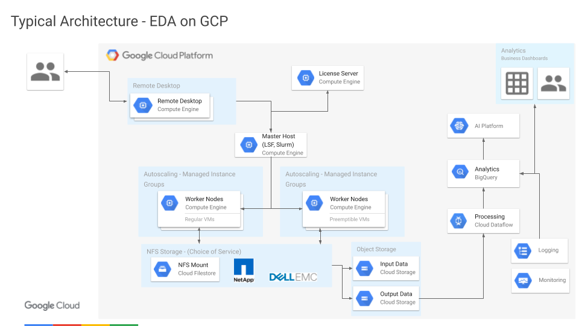

# EDA Workloads on Google Cloud

Here are examples of template snippets used to spin up Google Cloud resources
for EDA workloads.

Examples include:

- [All on Cloud](#example---all-on-cloud-option)
- Burst to Cloud (TBD)

Please note that these are provided only as examples to help guide
infrastructure planning and are not intended for use in production. They are
deliberately simplified for clarity and lack significant details required for
production-worthy infrastructure implementation.

---

# Example - All-on-Cloud Option

## Setup

### Google Cloud

    [GCP account and project creation boilerplate]

### Cloudshell

Open a Cloudshell

### Example source

Get the source

    git clone <this_repo_url>
    cd gcp-eda-examples

All example commands below are relative to this top-level directory of the
examples repo.

### Tools

We use [Terraform](terraform.io) for these examples and the latest version is
already installed in your GCP Cloudshell.

## Create a license server

Create an instance used to run a license manager in GCP.

    cd terraform/licensing
    terraform init
    terraform plan
    terraform apply

This creates an example instance and shows how license manager binaries and
dependencies can be installed using `provision.sh` during instance creation.

## Create NFS volumes

Create two NFS volumes using Google Cloud Filestore.  One for `/home` (3TB) and
one for `/tools` (3TB).

    cd terraform/storage
    terraform init
    terraform plan
    terraform apply

Note the output IP addresses reported from the `apply`.

## Create a Slurm cluster

Create an example slurm cluster with a single `debug` partition that scales
dynamically in GCP.

Change to the slurm "basic" example directory

    cd terraform/slurm-gcp/tf/examples/basic

Edit `basic.tfvars` to set the missing GCP project name (required) at the top

    cluster_name = "g1"
    project      = "<project>" # replace this with your GCP project name
    zone         = "us-west1-b"

and (optionally) add config for your NFS volumes by changing

    # Optional network storage fields
    # network_storage is mounted on all instances
    # login_network_storage is mounted on controller and login instances
    # network_storage = [{
    #   server_ip     = "<storage host>"
    #   remote_mount  = "/home"
    #   local_mount   = "/home"
    #   fs_type       = "nfs"
    #   mount_options = null
    # }]

to read

    # Optional network storage fields
    # network_storage is mounted on all instances
    # login_network_storage is mounted on controller and login instances
    network_storage = [{
      server_ip     = "10.11.12.1" # from output of storage step above
      remote_mount  = "/tools"
      local_mount   = "/tools"
      fs_type       = "nfs"
      mount_options = "defaults,hard,intr"
    },{
      server_ip     = "10.11.12.2" # from output of storage step above
      remote_mount  = "/home"
      local_mount   = "/home"
      fs_type       = "nfs"
      mount_options = "defaults,hard,intr"
    }]

Note the IP addresses for the NFS volumes come from the output of the "storage"
steps above.

Next spin up the cluster.
Still within the Slurm basic example directory above, run

    terraform init
    terraform plan
    terraform apply

and wait for the resources to be created.

Note that creating a Slurm cluster using `slurm-gcp` involves a two-step
process:

- Use terraform to create cluster resources for controllers, login nodes, and
  a compute image template.  This is what you did immediately above and should
  take only a minute or two.  Slurm is _not_ ready to use yet.

- Wait for Slurm to creating a compute node template.  This will be used to
  dynamically create cluster compute nodes on demand.

  At startup, Slurm creates GCP VM images for compute nodes based on custom
  build scripts in the `slurm-gcp/scripts/` directory using an instance named
  `<cluster_name>-compute-<partition_index>-image` (e.g.,
  `mycluster-compute-0-image`). This part can take a few minutes. When Slurm is
  done creating the compute node template, it will terminate this instance and
  is then ready to use.

## Run Slurm jobs

Log into one of the Slurm login nodes

    gcloud compute ssh <cluster_name>-login0

which should show something like the following

At the prompt you can run various slurm commands.

For general cluster info you can use
[`sinfo`](https://slurm.schedmd.com/sinfo.html)

    sinfo

[`squeue`](https://slurm.schedmd.com/squeue.html)

    squeue

You can run a synchronous job on 2 nodes using
[`srun`](https://slurm.schedmd.com/srun.html)

    srun -N sleep 300

and you can submit batch jobs using
[`sbatch`](https://slurm.schedmd.com/sbatch.html).

Notice the first time you run any sort of job on Slurm it will take a little
longer because it's dynamically spinning the resources (compute nodes) it needs
in GCP.  Please also note that these resources spin back down when not in use.
You can set the time a compute node sits idle using `suspend_time` in the
`basic.tfvars` cluster config.

