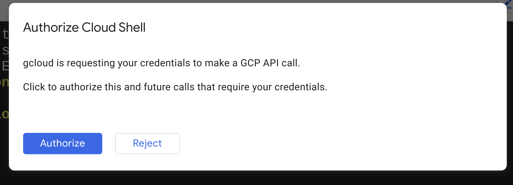
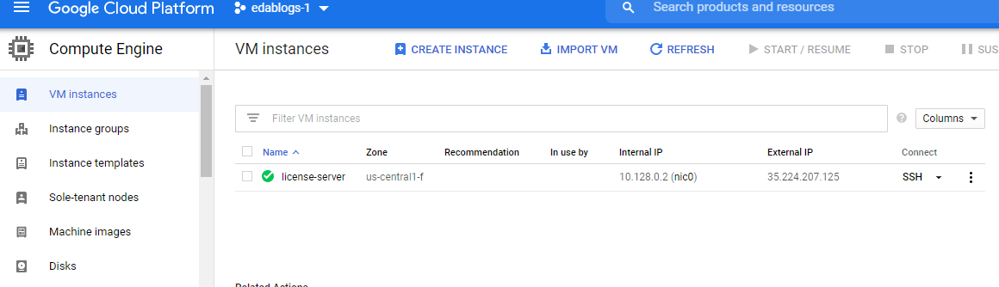
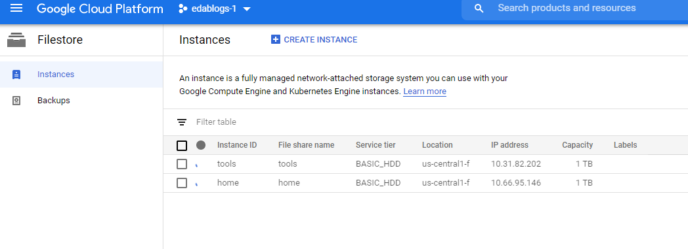
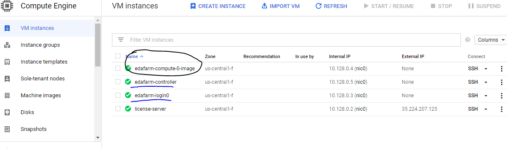
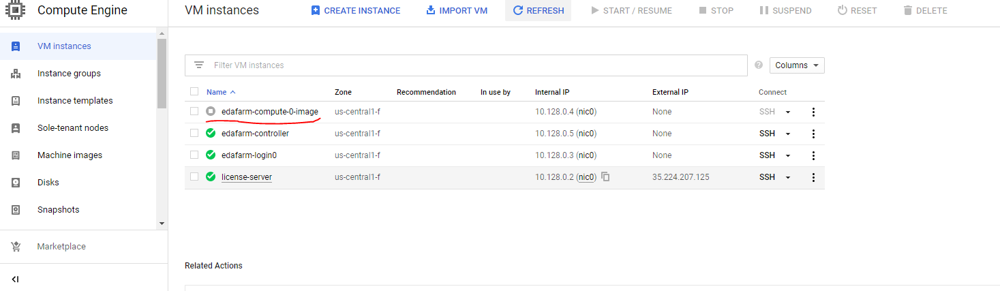

# Example - All-on-Cloud Option

Here are some example template snippets used to spin up Google Cloud resources
to run EDA workloads in an "All on Cloud" scenario.

Please note that these are provided only as examples to help guide
infrastructure planning and are not intended for use in production. They are
deliberately simplified for clarity and lack significant details required for
production-worthy infrastructure implementation.

## Costs

If you run the example commands below, you will use billable components of
Google Cloud Platform, including:

- Compute Engine
- Cloud Filestore

You can use the
[Pricing Calculator](https://cloud.google.com/products/calculator)
to generate a cost estimate based on your projected usage.

Check out the [Google Cloud Free
Program](https://cloud.google.com/free/docs/gcp-free-tier) for potential
credits for tutorial resources.

## Before you begin

Start by opening
[https://console.cloud.google.com/](https://console.cloud.google.com/)
in a browser.

Create a new GCP Project using the
[Cloud Resource Manager](https://console.cloud.google.com/cloud-resource-manager).
The project you create is just for this example, so you'll delete it below
when you're done.

You will need to
[enable billing](https://support.google.com/cloud/answer/6293499#enable-billing)
for this project.

You will also need to enable the Compute Engine (GCE) service for this account

You need to enable Compute Engine and Filestore services as enabling these APIs
allows you to create the required resources. It is likely that a central
organization such as the IT organization may ultimately provide this
functionality, but to run the example successfully, you need to enable the
required APIs using GCP's intuitive APIs.

You can enable APIs by navigating to the APIs view from the dashboard view.

Search for 'Compute' and 'Filestore' and enable these APIs. After successful
enabling of APIs, you should be able to confirm it in the Console:

Alternatively, you can also click the link below for enabling the required APIs.

[Enable Example Services](https://console.cloud.google.com/flows/enableapi?apiid=compute.googleapis.com,file.googleapis.com,cloudresourcemanager.googleapis.com)
    
Next, make sure the project you just created is selected in the top of the
Cloud Console.

Then open a Cloud Shell associated with the project you just created

[Launch Cloud Shell](https://console.cloud.google.com/?cloudshell=true)

It's important that the current Cloud Shell project is the one you just
created.  Verify that

    echo $GOOGLE_CLOUD_PROJECT

shows that new project.

All example commands below run from this Cloud Shell.

The examples files and steps below assume that you are using the project's "default" network.  

If you are using a network that you have created yourself you may need to edit the Terraform files to use your network instead of default.  
Additionally there are a number of firewall rules that need to be opened to ensure that the Compute Instances can talk to each other and the NFS volumes.  
They are as follows:
-  TCP and UDP on ports 111, 2049,20048 for NFS
-  TCP 6800-6850 and 30000-63000 for slurm

## Example source

Get the source

    git clone https://github.com/GoogleCloudPlatform/eda-examples
    cd eda-examples

All example commands below are relative to this top-level directory of the
examples repo.

## Tools

We use [Terraform](terraform.io) for these examples and the latest version is
already installed in your GCP Cloudshell.

## Create a license server

Create an instance used to run a license manager in GCP.

    cd terraform/licensing
    terraform init
    terraform plan
    terraform apply

This creates an example instance and shows how license manager binaries and
dependencies can be installed using `provision.sh` during instance creation.

Note that [Sole-Tenant Nodes](https://cloud.google.com/sole-tenant-nodes)
are available and commonly used for license and key-management servers.

This process should complete in a few minutes. You may need to authorize specific API calls if a pop-up like the one below
appears:

Once this step is successful, you can navigate to the Compute Instances view and
should see the new resource:

## Create NFS volumes

Create two NFS volumes using Google Cloud Filestore.  One for `/home` (1TB) and
one for `/tools` (1TB).

    cd ../storage
    terraform init
    terraform plan
    terraform apply

Note the output IP addresses reported from the `apply` as you'll need them
in the next step to configure the slurm cluster.

Once this step is successful, you can navigate to the Filestore Instances view and
should see the new resources:

## Create a Slurm cluster

Create an example slurm cluster with a single `debug` partition that scales
dynamically in GCP.

Change to the slurm cluster example directory

    cd ../slurm-cluster

Edit `basic.tfvars` to set some missing variables.

You need to edit 3 fields: project, 2 server ips.

Near the top, the project name (required) and the zone should match everywhere

    project      = "<project>" # replace this with your GCP project name

and then further down, fix the config for your NFS volumes by changing the
`server_ip` entries to match the values for the volumes created above

    # Optional network storage fields
    # network_storage is mounted on all instances
    # login_network_storage is mounted on controller and login instances
    network_storage = [{
      server_ip     = "10.11.12.1" # from output of storage step above
      remote_mount  = "/home"
      local_mount   = "/home"
      fs_type       = "nfs"
      mount_options = "defaults,hard,intr"
    },{
      server_ip     = "10.11.12.2" # from output of storage step above
      remote_mount  = "/tools"
      local_mount   = "/tools"
      fs_type       = "nfs"
      mount_options = "defaults,hard,intr"
    }]

Note the IP addresses for the NFS volumes come from the output of the "storage"
steps above. This step may take a few minutes as well. 

Next spin up the cluster.
Still within the Slurm basic example directory above, run

    terraform init
    terraform plan -var-file basic.tfvars
    terraform apply -var-file basic.tfvars

and wait for the resources to be created.

Note that creating a Slurm cluster using `slurm-gcp` involves a two-step
process:

- Use terraform to create cluster resources for controllers, login nodes, and
  a compute image template.  This is what you did immediately above and should
  take only a minute or two.  Slurm is _not_ ready to use yet.

- Wait for Slurm to create a compute node template.  This will be used to
  dynamically create cluster compute nodes on demand.

  At startup, Slurm creates GCP VM images for compute nodes based on custom
  build scripts in the `slurm-gcp/scripts/` directory using an instance named
  `<cluster_name>-compute-<partition_index>-image` (e.g.,
  `mycluster-compute-0-image`). This part can take a few minutes. When Slurm is
  done creating the compute node template, it will terminate this instance and
  is then ready to use.

The above process can take several minutes. During the process, you can navigate
to the compute resources view and you should see something like below:

You can be sure that the SLURM cluster is ready to use when the
'edafarm-compute-0-image' node (circled in black) becomes inactive. 

## Run Slurm jobs

Log into the Slurm login node

    gcloud compute ssh <cluster_name>-login0 --zone <zone>

for example

    gcloud compute ssh edafarm-login0 --zone us-central1-f

which should show something like the following

    External IP address was not found; defaulting to using IAP tunneling.
    Warning: Permanently added 'compute.1234567' (ECDSA) to the list of known hosts.

                                     SSSSSSS
                                    SSSSSSSSS
                                    SSSSSSSSS
                                    SSSSSSSSS
                            SSSS     SSSSSSS     SSSS
                           SSSSSS               SSSSSS
                           SSSSSS    SSSSSSS    SSSSSS
                            SSSS    SSSSSSSSS    SSSS
                    SSS             SSSSSSSSS             SSS
                   SSSSS    SSSS    SSSSSSSSS    SSSS    SSSSS
                    SSS    SSSSSS   SSSSSSSSS   SSSSSS    SSS
                           SSSSSS    SSSSSSS    SSSSSS
                    SSS    SSSSSS               SSSSSS    SSS
                   SSSSS    SSSS     SSSSSSS     SSSS    SSSSS
              S     SSS             SSSSSSSSS             SSS     S
             SSS            SSSS    SSSSSSSSS    SSSS            SSS
              S     SSS    SSSSSS   SSSSSSSSS   SSSSSS    SSS     S
                   SSSSS   SSSSSS   SSSSSSSSS   SSSSSS   SSSSS
              S    SSSSS    SSSS     SSSSSSS     SSSS    SSSSS    S
        S    SSS    SSS                                   SSS    SSS    S
        S     S                                                   S     S
                    SSS
                    SSS
                    SSS
                    SSS
     SSSSSSSSSSSS   SSS   SSSS       SSSS    SSSSSSSSS   SSSSSSSSSSSSSSSSSSSS
    SSSSSSSSSSSSS   SSS   SSSS       SSSS   SSSSSSSSSS  SSSSSSSSSSSSSSSSSSSSSS
    SSSS            SSS   SSSS       SSSS   SSSS        SSSS     SSSS     SSSS
    SSSS            SSS   SSSS       SSSS   SSSS        SSSS     SSSS     SSSS
    SSSSSSSSSSSS    SSS   SSSS       SSSS   SSSS        SSSS     SSSS     SSSS
     SSSSSSSSSSSS   SSS   SSSS       SSSS   SSSS        SSSS     SSSS     SSSS
             SSSS   SSS   SSSS       SSSS   SSSS        SSSS     SSSS     SSSS
             SSSS   SSS   SSSS       SSSS   SSSS        SSSS     SSSS     SSSS
    SSSSSSSSSSSSS   SSS   SSSSSSSSSSSSSSS   SSSS        SSSS     SSSS     SSSS
    SSSSSSSSSSSS    SSS    SSSSSSSSSSSSS    SSSS        SSSS     SSSS     SSSS

    [some_user_example_com@edafarm-login0 ~]$

At the prompt you can run various slurm commands.

For general cluster info you can use
[`sinfo`](https://slurm.schedmd.com/sinfo.html)

    sinfo

and see something like

    [some_user_example_com@edafarm-login0 ~]$ sinfo
    PARTITION AVAIL  TIMELIMIT  NODES  STATE NODELIST
    debug*       up   infinite     10  idle~ edafarm-compute-0-[0-9]

or [`squeue`](https://slurm.schedmd.com/squeue.html)

    squeue

You can run a synchronous job on 2 nodes using
[`srun`](https://slurm.schedmd.com/srun.html)

    srun -N sleep 300

and you can submit batch jobs using
[`sbatch`](https://slurm.schedmd.com/sbatch.html).

Notice the first time you run any sort of job on Slurm it will take a little
longer because it's dynamically spinning the resources (compute nodes) it needs
in GCP.  Please also note that these resources spin back down when not in use.
You can set the time a compute node sits idle using `suspend_time` in the
`basic.tfvars` cluster config.

## Run an EDA job

Once the cluster is up, you are ready to run EDA jobs. For this example, we
will be running an open source functional verification regression. Further, we
also use an open source simulator (Icarus) that has been pre-installed in the
image.

From the login node, download an example design project from

    wget https://github.com/PrincetonUniversity/openiton/archive/openpiton-19-10-23-r13.tar.gz

Extract this

    tar xzvf openpiton-19-10-23-r13.tar.gz
    cd openpiton-openpiton-19-10-23-r13

And you can execute this across the slurm cluster using

    sims -sim_type=icv -group=tile1_mini -slurm -sim_q_command=sbatch

which will kick off jobs across the cluster.
    
You can use `sinfo` and `squeue` to see progress.

## Cleaning up

To avoid incurring charges to your Google Cloud Platform account for the
resources used in this tutorial:

### Delete the project using the GCP Cloud Console

The easiest way to clean up all of the resources used in this tutorial is
to delete the project that you initially created for the tutorial.

Caution: Deleting a project has the following effects:
- Everything in the project is deleted. If you used an existing project for
  this tutorial, when you delete it, you also delete any other work you've done
  in the project.
- Custom project IDs are lost. When you created this project, you might have
  created a custom project ID that you want to use in the future. To preserve
  the URLs that use the project ID, such as an appspot.com URL, delete selected
  resources inside the project instead of deleting the whole project.

1. In the GCP Console, go to the Projects page.

    GO TO THE PROJECTS PAGE

2. In the project list, select the project you want to delete and click Delete
   delete.
3. In the dialog, type the project ID, and then click Shut down to delete the
   project.

### Deleting resources using Terraform

Alternatively, if you added the tutorial resources to an _existing_ project, you
can still clean up those resources using Terraform.

From the `slurm-cluster` sub-directory, run

    terraform destroy -var-file basic.tfvars

then

    cd ../storage
    terraform destroy

and

    cd ../licensing
    terraform destroy

## What's next

There are so many exciting directions to take to learn more about what you've
done here!

- Infrastructure.  Learn more about
  [Cloud](https://cloud.google.com/),
  [Slurm](https://slurm.schedmd.com/overview.html),
  High Performance Computing (HPC) on GCP
  [reference architectures](https://cloud.google.com/solutions/hpc/) and 
  [posts](https://cloud.google.com/blog/topics/hpc).

