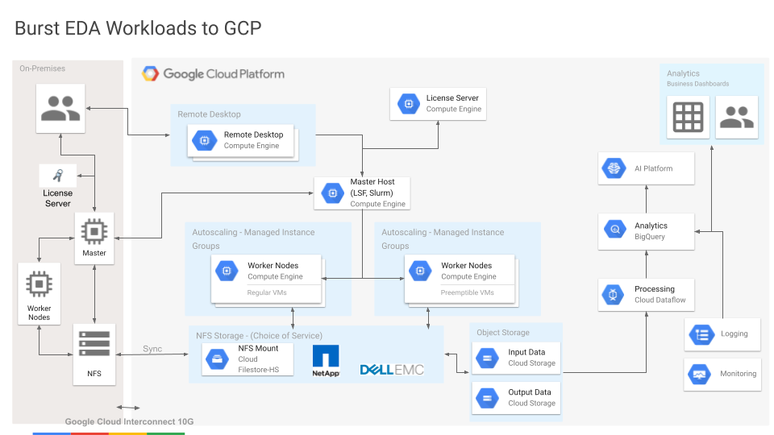

# Example - Burst-to-Cloud Option

In this scenario, we mock up an on-permises slurm cluster and a GCP-based slurm
cluster.  We then submit jobs to either cluster and discuss performance
ramifications.

## Costs

If you run the example commands below, you will use billable components of
Google Cloud Platform, including:

- Compute Engine

You can use the
[Pricing Calculator](https://cloud.google.com/products/calculator)
to generate a cost estimate based on your projected usage.

## Before you begin

Start by opening
[https://console.cloud.google.com/](https://console.cloud.google.com/)
in a browser.

Create a new GCP Project using the
[Cloud Resource Manager](https://console.cloud.google.com/cloud-resource-manager).
The project you create is just for this example, so you'll delete it below
when you're done.

You will need to
[enable billing](https://support.google.com/cloud/answer/6293499#enable-billing)
for this project.

You will also need to enable the Compute Engine (GCE) service for this account

[Enable Example Services](https://console.cloud.google.com/flows/enableapi?apiid=compute.googleapis.com,cloudresourcemanager.googleapis.com)
    
Next, make sure the project you just created is selected in the top of the
Cloud Console.

Then open a Cloud Shell associated with the project you just created

[Launch Cloud Shell](https://console.cloud.google.com/?cloudshell=true)

It's important that the current Cloud Shell project is the one you just
created.  Verify that

    echo $GOOGLE_CLOUD_PROJECT

shows that new project.

All example commands below run from this Cloud Shell.

## Example source

Get the source

    git clone <this_repo_url>
    cd eda-examples

All example commands below are relative to this top-level directory of the
examples repo.

## Tools

We use [Terraform](terraform.io) for these examples and the latest version is
already installed in your GCP Cloudshell.

## Setup networking for this example

Network configuration for on-premises HPC environments can vary quite a bit
from organization to organization and there will be many options to consider
when trying to wire up on-premises and Cloud environments.  Will you have a
dedicated or partner-provided Cloud Interconnect?  Will you use a shared VPC or
will you use a VPC gateway to connect the networks?  How will you handle
authentication?  How will you handle DNS names?

This tutorial covers the basics of bursting jobs up to the cloud so we'll start
with the simplest networking possible to show submitting jobs across two
Slurm clusters.

We'll use two separate networks `onprem` and `burst` that can:

- talk to each other (all icmp, tcp, and udp traffic is routed between them)
- use machine names instead of IP addresses (DNS names resolve across both nets)

The `onprem` network lives in the cloud but is meant to represent an
on-premises network segment that can communicate with cloud resources.

To create the networking infrastructure used in this example, first change to
the right directory

    cd terraform/onprem-burst-networks

and then

    terraform init
    terraform plan
    terraform apply

You can check that the network resources were created using commands such as

    gcloud compute networks subnets list

and

    gcloud compute firewall-rules list

## Create an "onprem" Slurm cluster in GCP

Create an example slurm cluster with a single `debug` partition that scales
dynamically in GCP.

Change to the slurm cluster example directory

    cd onprem-slurm-cluster

Edit `onprem-cluster.tfvars` to set some missing variables.
Near the top, the project name (required) and the zone should match everywhere

    project      = "<project>" # replace this with your GCP project name

and then spin up the cluster.
Still within the `onprem-slurm-cluster` example directory above, run

    terraform init
    terraform plan -var-file onprem-cluster.tfvars
    terraform apply -var-file onprem-cluster.tfvars

and wait for the resources to be created.

Note that creating a Slurm cluster using `slurm-gcp` involves a two-step
process:

- Use terraform to create cluster resources for controllers, login nodes, and
  a compute image template.  This is what you did immediately above and should
  take only a minute or two.  Slurm is _not_ ready to use yet.

- Wait for Slurm to creating a compute node template.  This will be used to
  dynamically create cluster compute nodes on demand.

  At startup, Slurm creates GCP VM images for compute nodes based on custom
  build scripts in the `slurm-gcp/scripts/` directory using an instance named
  `<cluster_name>-compute-<partition_index>-image` (e.g.,
  `mycluster-compute-0-image`). This part can take a few minutes. When Slurm is
  done creating the compute node template, it will terminate this instance and
  is then ready to use.

## Create the "burst" Slurm cluster in GCP

Create another example slurm cluster with a single `debug` partition that scales
dynamically in GCP.

Please note that in order to reproduce the analysis described in the
accompanying
[blog post](https://cloud.google.com/blog/products/compute/faster-chip-design-with-hybrid-silicon-workflows)),
this cluster is configured to use large compute-optimized machine types for the
"login" node as well as the "compute" nodes.

**The following cluster will not work with the Google Cloud Free Tier** and you
will need sufficient quota for the `C2_CPU` cores that are currently
configured. Alternatively, please adjust the machine types in the burst slurm
config file below.

Change to the slurm cluster example directory

    cd burst-slurm-cluster

Edit `burst-cluster.tfvars` to set some missing variables.
Near the top, the project name (required) and the zone should match everywhere

    project      = "<project>" # replace this with your GCP project name

and then spin up the cluster.
Still within the `burst-slurm-cluster` example directory above, run

    terraform init
    terraform plan -var-file burst-cluster.tfvars
    terraform apply -var-file burst-cluster.tfvars

and wait for the resources to be created.

Note again that creating a Slurm cluster using these example templates involves a two-step
process (described above) and will take ~5mins.

## Run Slurm job on the "onprem" cluster

Log into one of the Slurm login nodes for the "onprem" cluster:

    gcloud compute ssh onprem-login0 --zone <zone>

which should show something like the following

    External IP address was not found; defaulting to using IAP tunneling.
    Warning: Permanently added 'compute.1234567' (ECDSA) to the list of known hosts.

                                     SSSSSSS
                                    SSSSSSSSS
                                    SSSSSSSSS
                                    SSSSSSSSS
                            SSSS     SSSSSSS     SSSS
                           SSSSSS               SSSSSS
                           SSSSSS    SSSSSSS    SSSSSS
                            SSSS    SSSSSSSSS    SSSS
                    SSS             SSSSSSSSS             SSS
                   SSSSS    SSSS    SSSSSSSSS    SSSS    SSSSS
                    SSS    SSSSSS   SSSSSSSSS   SSSSSS    SSS
                           SSSSSS    SSSSSSS    SSSSSS
                    SSS    SSSSSS               SSSSSS    SSS
                   SSSSS    SSSS     SSSSSSS     SSSS    SSSSS
              S     SSS             SSSSSSSSS             SSS     S
             SSS            SSSS    SSSSSSSSS    SSSS            SSS
              S     SSS    SSSSSS   SSSSSSSSS   SSSSSS    SSS     S
                   SSSSS   SSSSSS   SSSSSSSSS   SSSSSS   SSSSS
              S    SSSSS    SSSS     SSSSSSS     SSSS    SSSSS    S
        S    SSS    SSS                                   SSS    SSS    S
        S     S                                                   S     S
                    SSS
                    SSS
                    SSS
                    SSS
     SSSSSSSSSSSS   SSS   SSSS       SSSS    SSSSSSSSS   SSSSSSSSSSSSSSSSSSSS
    SSSSSSSSSSSSS   SSS   SSSS       SSSS   SSSSSSSSSS  SSSSSSSSSSSSSSSSSSSSSS
    SSSS            SSS   SSSS       SSSS   SSSS        SSSS     SSSS     SSSS
    SSSS            SSS   SSSS       SSSS   SSSS        SSSS     SSSS     SSSS
    SSSSSSSSSSSS    SSS   SSSS       SSSS   SSSS        SSSS     SSSS     SSSS
     SSSSSSSSSSSS   SSS   SSSS       SSSS   SSSS        SSSS     SSSS     SSSS
             SSSS   SSS   SSSS       SSSS   SSSS        SSSS     SSSS     SSSS
             SSSS   SSS   SSSS       SSSS   SSSS        SSSS     SSSS     SSSS
    SSSSSSSSSSSSS   SSS   SSSSSSSSSSSSSSS   SSSS        SSSS     SSSS     SSSS
    SSSSSSSSSSSS    SSS    SSSSSSSSSSSSS    SSSS        SSSS     SSSS     SSSS

    [some_user_example_com@onprem-login0 ~]$

At the prompt you can run various slurm commands.

For general cluster info you can use
[`sinfo`](https://slurm.schedmd.com/sinfo.html)

    sinfo

and see something like

    [some_user_example_com@piton-login0 ~]$ sinfo
    PARTITION AVAIL  TIMELIMIT  NODES  STATE NODELIST
    debug*       up   infinite     10  idle~ onprem-compute-0-[0-9]

or [`squeue`](https://slurm.schedmd.com/squeue.html)

    squeue

You can run a synchronous job on 2 nodes using
[`srun`](https://slurm.schedmd.com/srun.html)

    srun -N sleep 300

and you can submit batch jobs using
[`sbatch`](https://slurm.schedmd.com/sbatch.html).

Notice the first time you run any sort of job on Slurm it will take a little
longer because it's dynamically spinning the resources (compute nodes) it needs
in GCP.  Please also note that these resources spin back down when not in use.
You can set the time a compute node sits idle using `suspend_time` in the
`onprem-cluster.tfvars` (or `burst-cluster.tfvars`) cluster config.

## Run an EDA job using "onprem" resources

From the "onprem" login node, download an example design project from

    wget https://github.com/PrincetonUniversity/openpiton/archive/openpiton-19-10-23-r13.tar.gz

Extract this

    tar xzvf openpiton-19-10-23-r13.tar.gz
    cd openpiton-openpiton-19-10-23-r13

And you can execute this using

    sims -executor slurm tiles

which will kick off jobs across the cluster.
    
You can use `sinfo` and `squeue` to see progress.

Exit from the `onprem-login0` node when you're done running jobs in the
"onprem" cluster.

## Sync job data between clusters

For a typical EDA job you would need to make sure that designs and libraries
were available for jobs to run in either cluster.

There are many ways to sync data between on-premises and cloud-based resources.
To keep things as simple as possible, we'll just download the example design
separately into each cluster.

Keep an eye out for future posts exploring the various storage synchronization
options commonly used when running EDA workloads in hybrid and cloud-based
environments.

## Run an EDA job using "burst" resources

Next, run the same job in the "burst" cluster which has access to different resources.

Log into one of the Slurm login nodes for the "burst" cluster:

    gcloud compute ssh burst-login0 --zone <zone>

From the "burst" login node, download an example design project from

    wget https://github.com/PrincetonUniversity/openpiton/archive/openpiton-19-10-23-r13.tar.gz

Extract this

    tar xzvf openpiton-19-10-23-r13.tar.gz
    cd openpiton-openpiton-19-10-23-r13

And you can execute this using

    sims -executor slurm tiles

which will kick off jobs across the cluster.
    
You can use `sinfo` and `squeue` to see progress with the "burst" cluster resources.

## Cleaning up

To avoid incurring charges to your Google Cloud Platform account for the
resources used in this tutorial:

### Delete the project using the GCP Cloud Console

The easiest way to clean up all of the resources used in this tutorial is
to delete the project that you initially created for the tutorial.

Caution: Deleting a project has the following effects:
- Everything in the project is deleted. If you used an existing project for
  this tutorial, when you delete it, you also delete any other work you've done
  in the project.
- Custom project IDs are lost. When you created this project, you might have
  created a custom project ID that you want to use in the future. To preserve
  the URLs that use the project ID, such as an appspot.com URL, delete selected
  resources inside the project instead of deleting the whole project.

1. In the GCP Console, go to the Projects page.

    GO TO THE PROJECTS PAGE

2. In the project list, select the project you want to delete and click Delete
   delete.
3. In the dialog, type the project ID, and then click Shut down to delete the
   project.

### Deleting resources using Terraform

Alternatively, if you added the tutorial resources to an _existing_ project, you
can still clean up those resources using Terraform.

From the `burst-slurm-cluster` sub-directory, run

    terraform destroy -var-file burst-cluster.tfvars

then 

    cd ../onprem-slurm-cluster
    terraform destroy -var-file onprem-cluster.tfvars

## What's next

There are so many exciting directions to take to learn more about what you've
done here!

- Infrastructure.  Learn more about
  [Cloud](https://cloud.google.com/),
  [Slurm](https://slurm.schedmd.com/overview.html),
  High Performance Computing (HPC) on GCP
  [reference architectures](https://cloud.google.com/solutions/hpc/) and 
  [posts](https://cloud.google.com/blog/topics/hpc).

